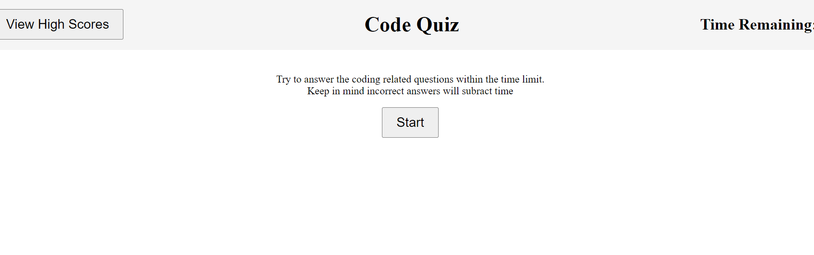

# kenscodequiz
## Description

The code quiz a way users can test their coding knowledge by answering questions before a timer runs out. The User will lose 10 seconds for every wrong answers and at the end of the test the amount of time left will be their score.

https://kwestbrook17.github.io/kenscodequiz/

